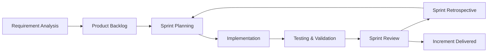
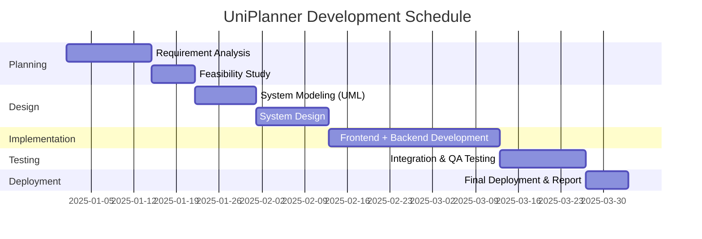
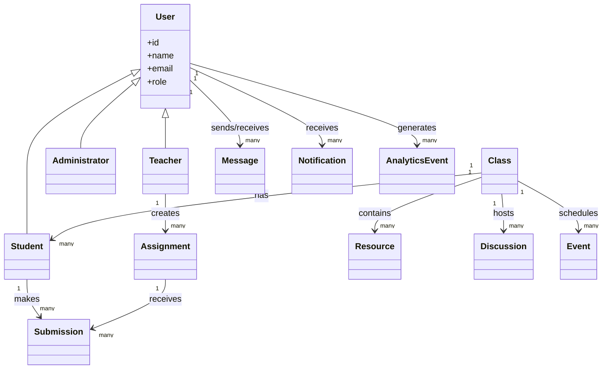
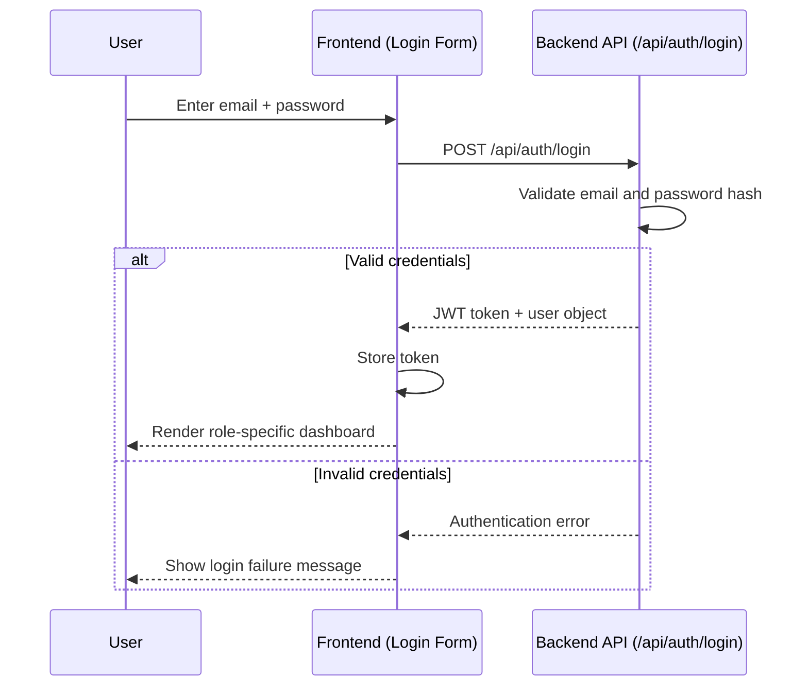
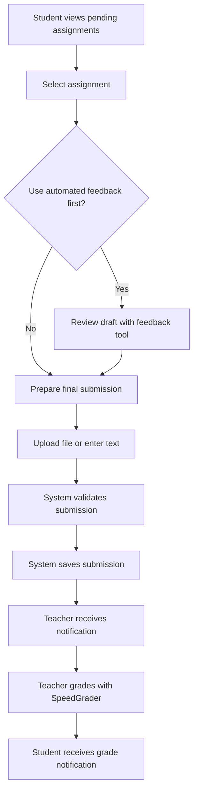
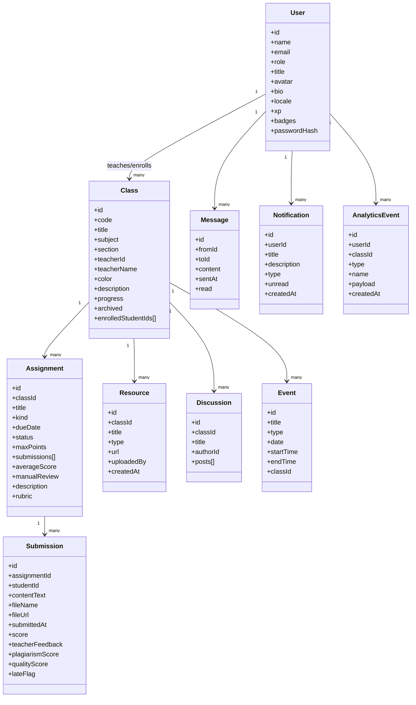
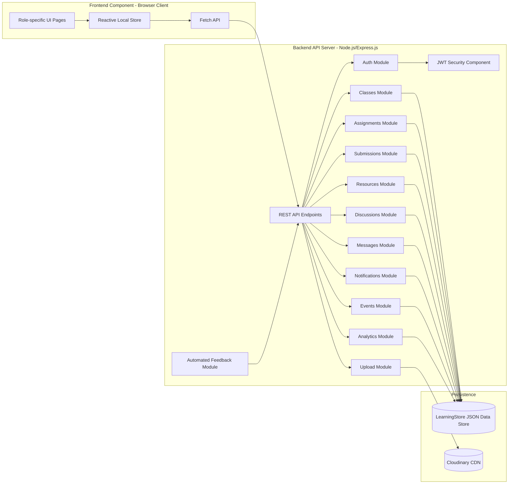
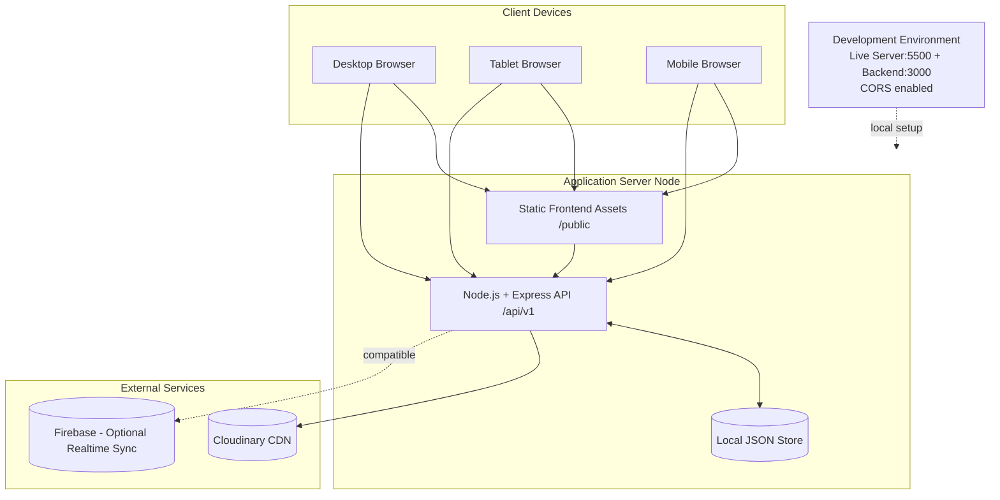

# UniPlanner Project Report Diagrams

This file provides clean, organized diagrams for the figure placeholders referenced in `UniPlanner_Project_Report.docx`.

## Figure 1.1: Agile Scrum Methodology



## Figure 3.1: Gantt Chart of UniPlanner Development Schedule



## Figure 3.2: Use Case Diagram of UniPlanner

```mermaid
usecaseDiagram
    actor Student
    actor Teacher
    actor Administrator as Admin

    Student --> (Login)
    Teacher --> (Login)
    Admin --> (Login)

    Student --> (View Dashboard)
    Teacher --> (View Dashboard)
    Admin --> (View Dashboard)

    Student --> (Enroll in Class)
    Student --> (Submit Assignment)
    Student --> (View Resources)

    Teacher --> (Create Assignment)
    Teacher --> (Grade Submission)
    Teacher --> (Upload Resource)

    Admin --> (Manage Users)
    Admin --> (View Analytics)
```

## Figure 3.3: Class Diagram of UniPlanner



## Figure 3.4: Sequence Diagram of Login and Dashboard Flow



## Figure 3.5: Activity Diagram of Assignment Submission Workflow



## Figure 4.1: Refined Class Diagram of UniPlanner



## Figure 4.2: Component Diagram of UniPlanner



## Figure 4.3: Deployment Diagram of UniPlanner


